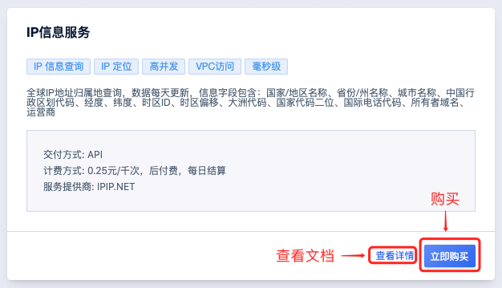
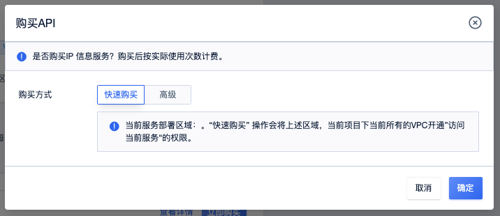
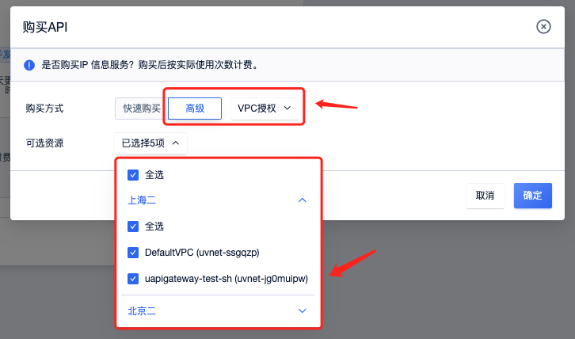
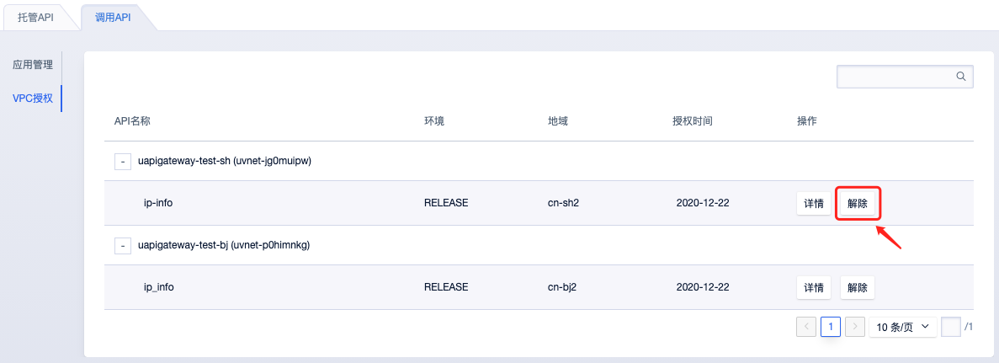

# IP 信息服务使用说明

#### 购买服务
1. 打开"[API 市场](https://console.ucloud.cn/uapimarket/uapimarket)“
2. 选择”IP 信息服务”
   
   

3. 快速购买
    
    * “对 VPC 授权访问”的方式进行购买，”快速购买“操作，会将当前 API 服务所地域（即region)下，当前项目下所有的VPC都授权访问当前 API 服务。 后续增加的 VPC，需要按”第4步“操作，手动添加新增 VPC 的授权访问。
    * VPC 授权访问后，在 VPC 内可直接访问，无需调用者处理鉴权相关。系统会自动对用户鉴权，对请求进行计费。
  

4. ”高级“ -- VPC 授权
   
   和”快速购买“一样，“对 VPC 授权访问”方式进行购买， 只是用户可以手动选择对哪些 VPC 授权
    

#### 补充 VPC 授权

   * 方法同 “购买服务” 的第4步

#### 取消对 VPC 的授权

1. 打开 [API 网关 VPC 授权管理](https://console.ucloud.cn/uapigateway/vpc)， 选择你想解除授权的 API， 点击“解除”
   

    